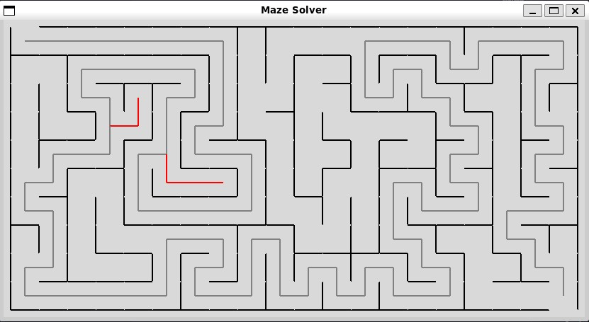

MazeSolver-Py


   
Overview
--------
MazeSolver-Py is a small Python project that builds and visually solves mazes using tkinter. The project separates UI (`window.py`), cell logic (`cell.py`) and maze generation/solver (`maze.py`). This document explains how to set up and run the window, create a maze programmatically, configure animation, and run tests.

Requirements
------------
- Python 3.10+ (the repository was developed and tested on 3.12)
- tkinter (usually included with the system Python)

If you're on Debian/Ubuntu and tkinter is missing:

```bash
sudo apt-get update
sudo apt-get install python3-tk
```

Quick start (script)
--------------------
1. Open a terminal in the project root.
2. Run the example `main.py` which creates a `Window`, a `Maze`, runs the solver, and waits for the window to close:

```bash
python3 main.py
```

This will open a window and show the maze being generated and solved.

Programmatic usage
------------------
Below are the minimal steps to create and show a maze from another script or an interactive session.

1. Create a `Window` instance. Provide a width and height (pixels).
2. Create a `Maze` instance with desired parameters and pass the `Window` instance.
3. Call `maze.solve()` to start solving (it will animate moves if a Window is provided).

Example:

```python
from window import Window
from maze import Maze

win = Window(800, 600)
maze = Maze(x1=10, y1=10, num_rows=10, num_cols=20, cell_size_x=30, cell_size_y=30, win=win)
maze.solve()
win.wait_for_close()
```

Important: `Maze.__init__` validates `num_rows` and `num_cols` and will raise:
- `TypeError` if rows/cols are not integers
- `ValueError` if rows/cols are not positive

Animation and performance
-------------------------
- The drawing and animation are handled in `Cell.draw_move`. For UI runs this will call `Window.redraw()` and sleep briefly to show movement.
- Tests patch the sleeps to avoid slowdowns. If you want to adjust animation speed in UI runs, consider editing `cell.py` (the sleep duration) or request a non-invasive change to add a `delay` parameter to `Maze`/`Window` so you can tune it without editing internals.

Testing
-------
Unit tests live in `tests.py` and use `unittest`. To run tests:

```bash
python3 -m unittest -v tests
```

Notes:
- Tests use a `TestWindow` double so they don't open a real GUI during the run.
- Tests patch `time.sleep` where needed so the suite runs quickly.

Troubleshooting
---------------
- "A Tk window pops up during tests": Make sure you run tests using the `tests` module explicitly (the project includes `main.py` which will open a real window when imported/executed). Use:

```bash
python3 -m unittest -v tests
```

or run the test file directly in an isolated environment.

- "No window appears when running main.py": Verify tkinter is installed and that the display is accessible (especially on headless servers). On Linux servers use an X server or run with virtual framebuffer (Xvfb) for automated runs.

- "Maze.solve() hangs": The `main.py` example calls `win.wait_for_close()` which enters an event loop until you close the window. This is expected behavior.

Design notes / robustness
-------------------------
- `Maze.__init__` validates inputs early and resizes the provided `Window` to fit the maze plus padding.
- `Cell.draw_move` centralizes redraw and sleep so the solver doesn't need to call a separate animate helper.
- The generator uses a recursive randomized depth-first carving algorithm; seed can be provided to `Maze` to get deterministic generation (call: `Maze(..., seed=1234)`).

Development tips
----------------
- If you want to iterate faster during development, set the animation sleep to a smaller value in `cell.py` or patch `cell.time.sleep` to a no-op in your test harness.
- Consider adding a `delay` parameter to `Maze` or `Window` to control animation speed at runtime without touching the code.

